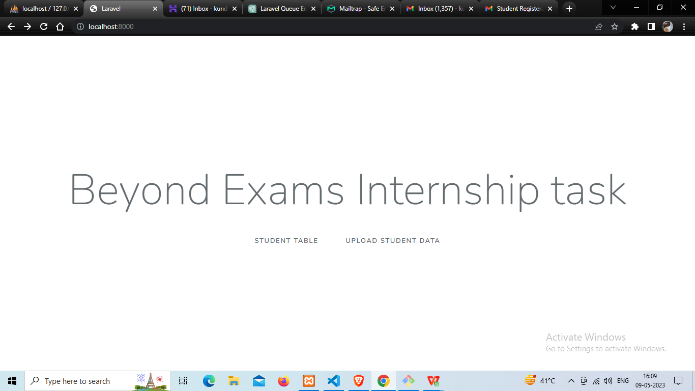
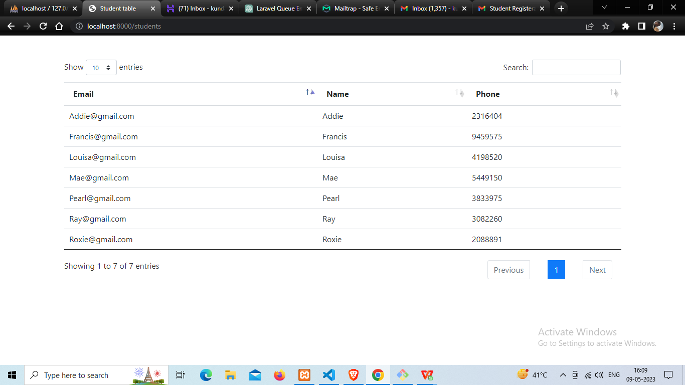
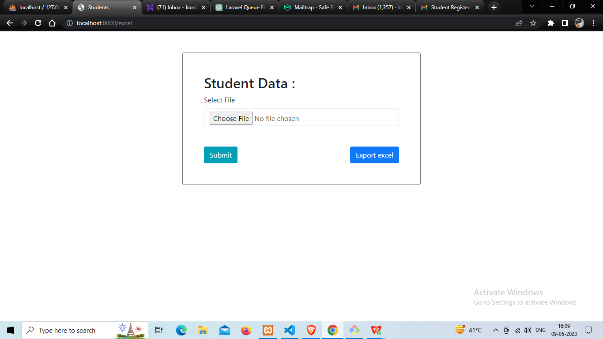

I created this application with laravel 7.3. With the app user can retrieve the data from database as an excel file. And also can upload data as excel file to sql database. sql database data can be viewed as a table with pagination and one can search the name, email, phone using search box.

1.  Clone the repository: First, you need to clone the repository to your local machine. You can do this by running the following command in your terminal or command prompt:
    git clone https://github.com/kk240/Beyond-Exams-task.git
2.  Install dependencies: Once you have cloned the repository, you need to install the project's dependencies using Composer. Navigate to the project directory in your terminal or command prompt and run the following command:
    composer install
    This will install all the required dependencies listed in the composer.json file.
3.  Create a database: with name as student. I used apache server and sql database from xampp server.
4.  Run database migrations: php artisan migrate
5.  serve the application: you can serve the application using the php artisan serve command. This will start a development server at http://localhost:8000.
